# Diagramas de Arquitectura Frontend - Sistema POS ERP

## 1. Arquitectura General del Frontend

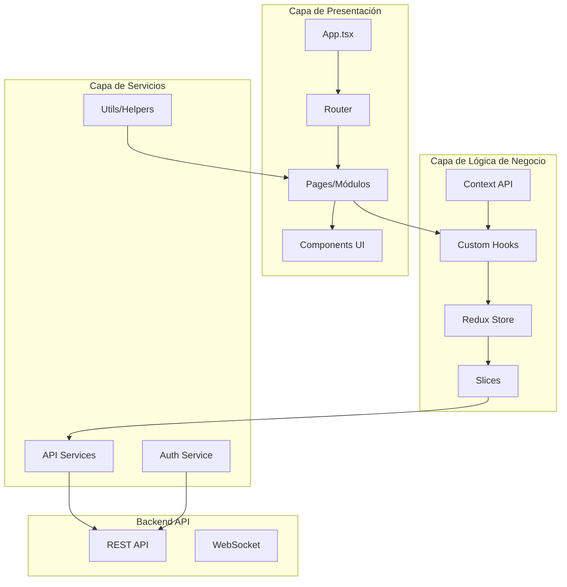

## 2. Estructura de Directorios

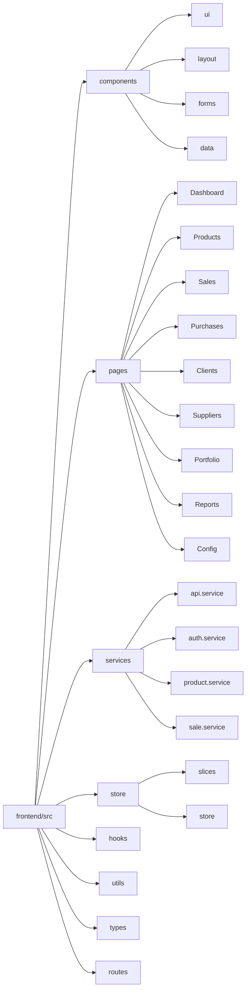

## 3. Flujo de Datos en Redux

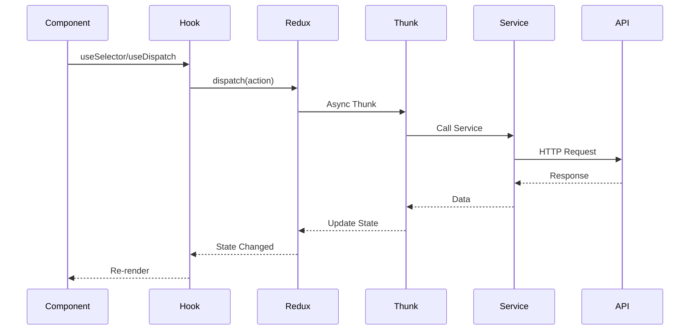

## 4. Flujo de Autenticación

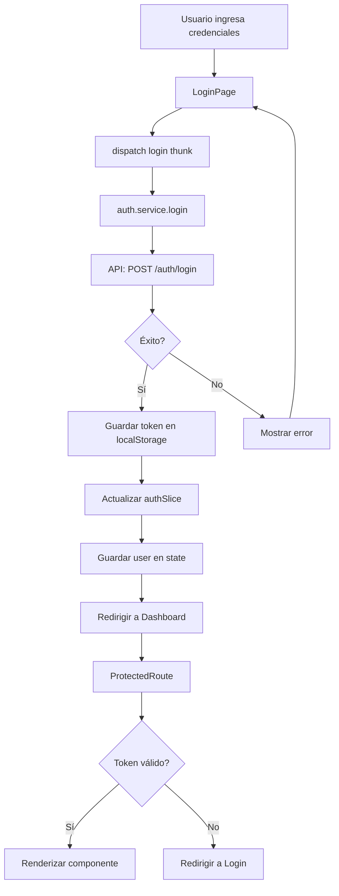

## 5. Arquitectura de Componentes (Atomic Design)

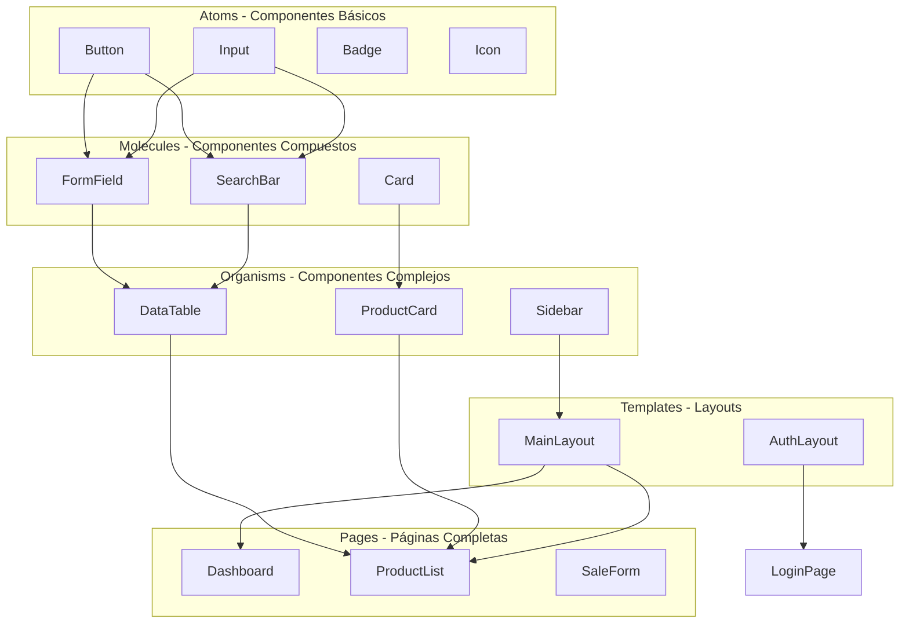

## 6. Flujo de Venta en POS

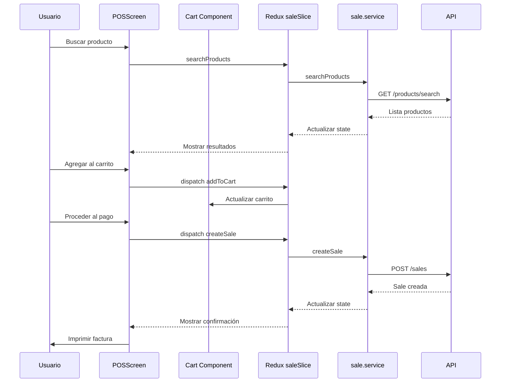

## 7. Sistema de Rutas

```mermaid
graph TD
    A[App Router] --> B{Autenticado?}
    B -->|No| C[Public Routes]
    B -->|Sí| D[Protected Routes]
    
    C --> C1[/login]
    C --> C2[/forgot-password]
    C --> C3[/reset-password]
    
    D --> D1[/dashboard]
    D --> D2[/products/*]
    D --> D3[/sales/*]
    D --> D4[/purchases/*]
    D --> D5[/clients/*]
    D --> D6[/suppliers/*]
    D --> D7[/portfolio/*]
    D --> D8[/reports/*]
    D --> D9[/config/*]
    
    D2 --> D2A[/products/list]
    D2 --> D2B[/products/new]
    D2 --> D2C[/products/:id]
    D2 --> D2D[/products/categories]
    
    D3 --> D3A[/sales/pos]
    D3 --> D3B[/sales/list]
    D3 --> D3C[/sales/:id]
    
    D --> E{Rol?}
    E -->|ADMIN| F[Todas las rutas]
    E -->|MANAGER| G[Rutas limitadas]
    E -->|CASHIER| H[Solo POS y ventas]
```

## 8. Gestión de Estado con Redux

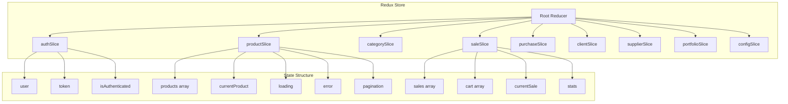

## 9. Ciclo de Vida de un Componente con Redux

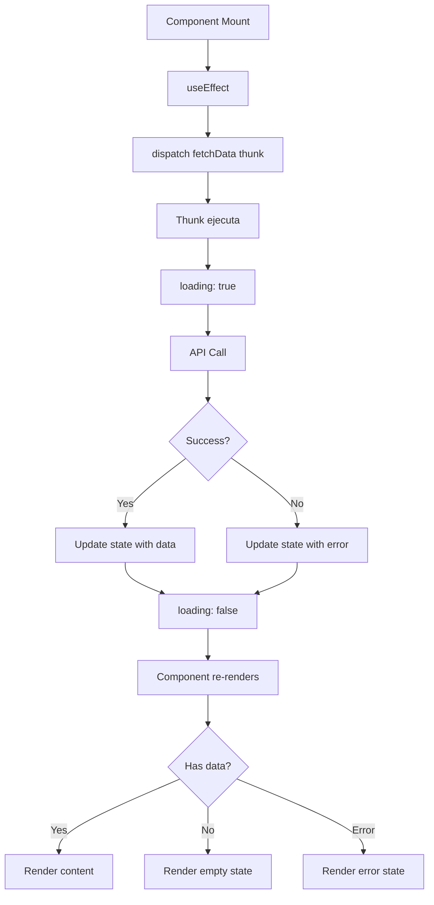

## 10. Patrón de Comunicación entre Componentes

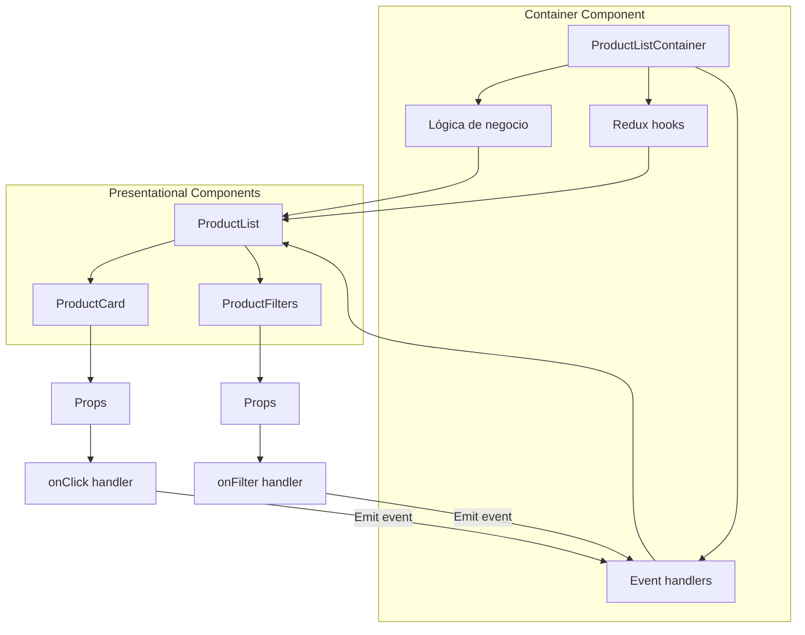

## 11. Flujo de Manejo de Errores

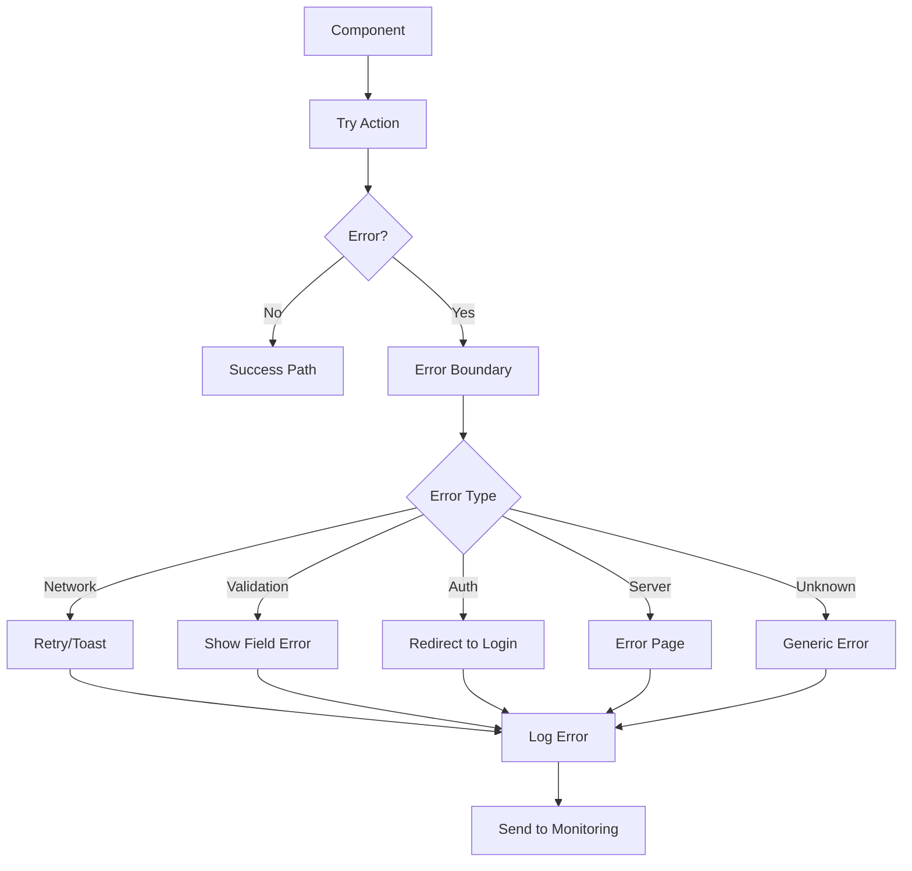

## 12. Optimización y Code Splitting

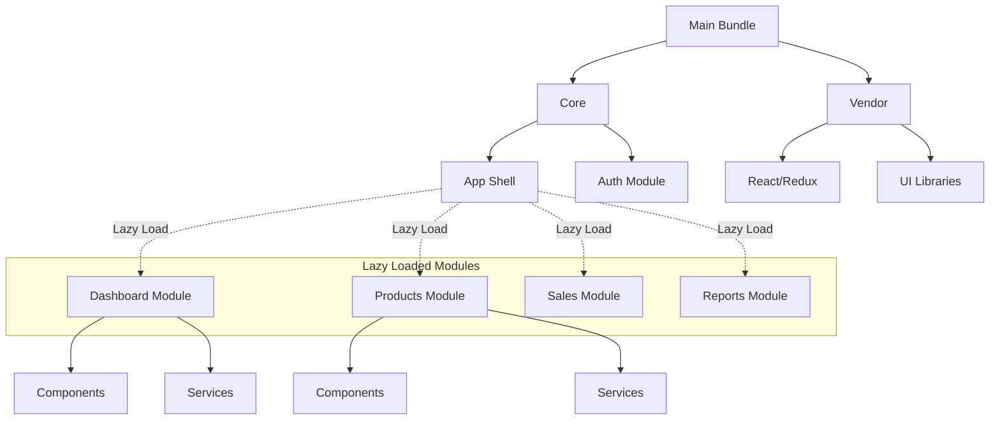

## 13. Flujo de Desarrollo de Funcionalidad

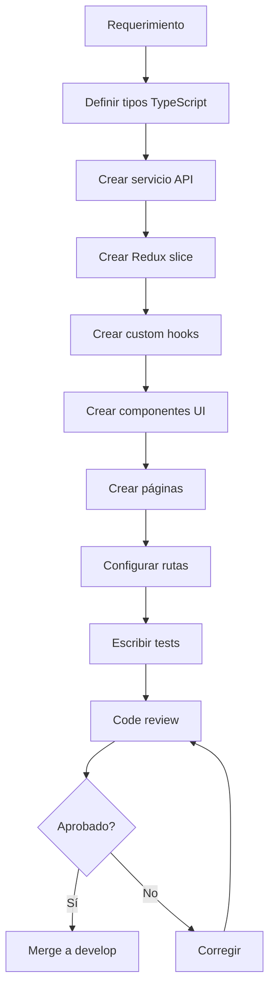

## 14. Arquitectura de Testing

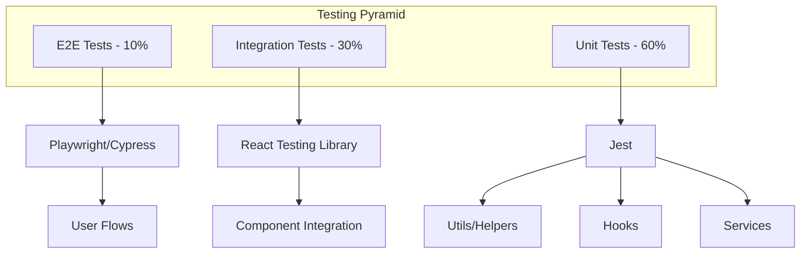

## 15. Pipeline de CI/CD

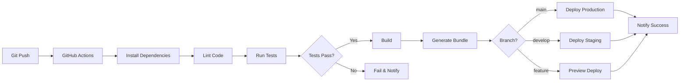

## Resumen de Patrones Utilizados

### Patrones de Diseño:
1. **Container/Presentational** - Separación de lógica y UI
2. **Compound Components** - Componentes compuestos flexibles
3. **Custom Hooks** - Reutilización de lógica
4. **Higher Order Components** - Funcionalidad compartida
5. **Render Props** - Patrones de renderizado flexible
6. **Provider Pattern** - Context API para estado global
7. **Singleton** - Servicios API únicos

### Patrones de Estado:
1. **Redux Toolkit** - Gestión de estado predecible
2. **Async Thunks** - Manejo de operaciones asíncronas
3. **Normalized State** - Estado normalizado para eficiencia
4. **Optimistic Updates** - Actualizaciones optimistas

### Patrones de Routing:
1. **Lazy Loading** - Carga diferida de módulos
2. **Protected Routes** - Rutas protegidas por autenticación
3. **Role-based Access** - Control de acceso por roles
4. **Nested Routes** - Rutas anidadas

### Patrones de UI:
1. **Atomic Design** - Estructura de componentes
2. **Composition** - Composición sobre herencia
3. **Controlled Components** - Formularios controlados
4. **Error Boundaries** - Manejo de errores en UI

---

**Nota**: Estos diagramas representan la arquitectura del frontend del sistema POS ERP. Cada diagrama muestra un aspecto diferente de la aplicación y cómo los diferentes componentes interactúan entre sí.
